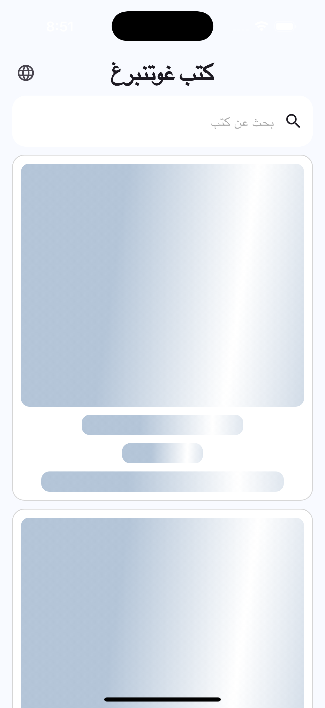
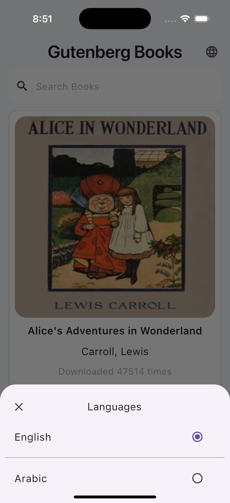
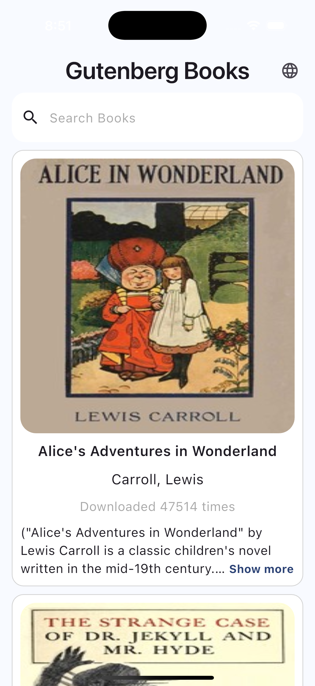
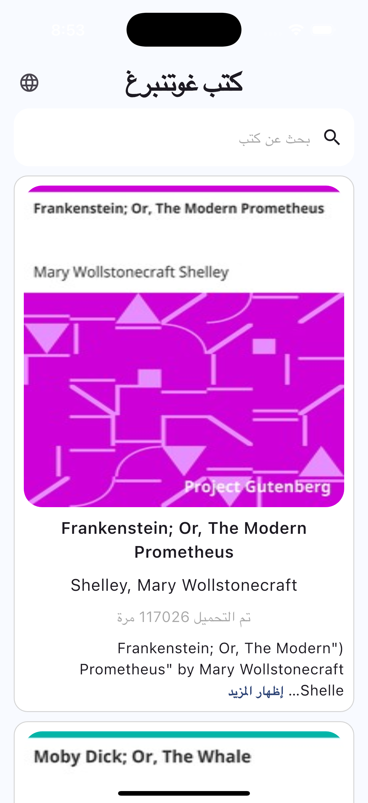
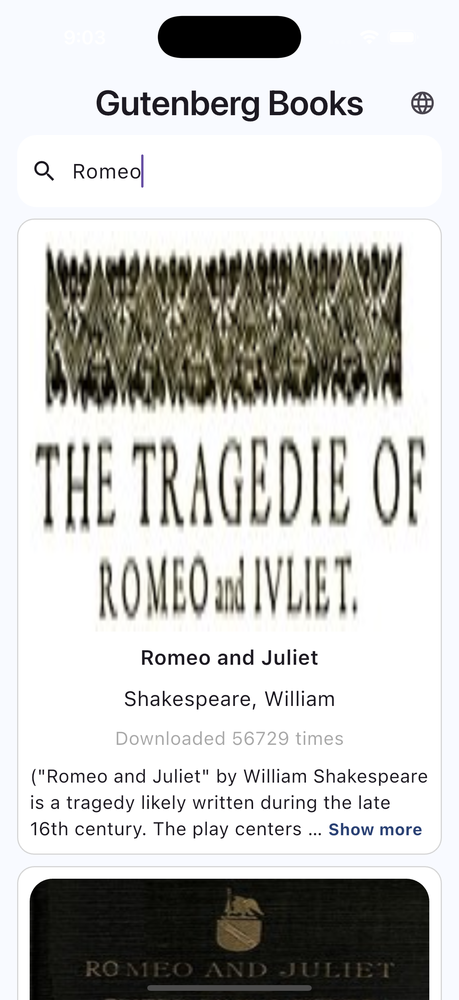
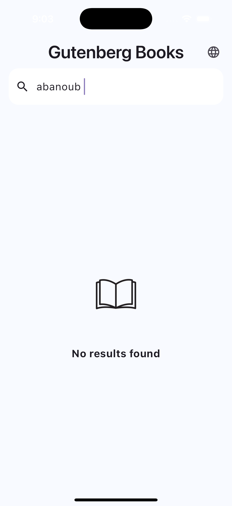
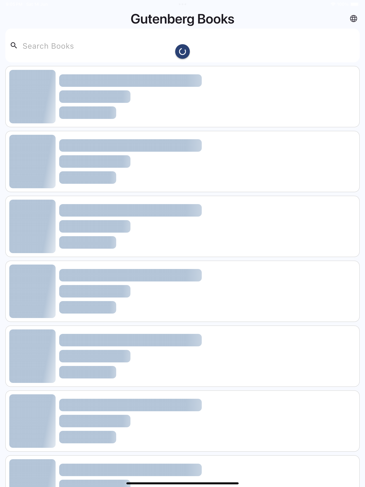
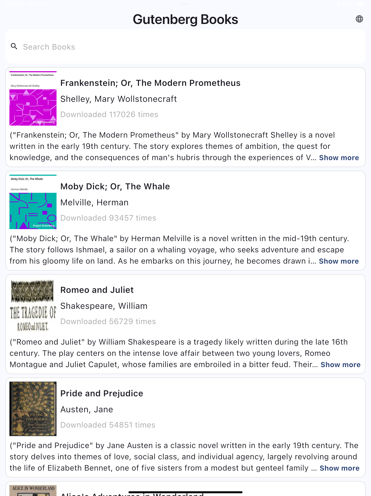

# 📚 books_app
A Flutter application that allows users to browse and search books with offline support, pagination, and clean architecture. 
Built with scalable, maintainable code using best practices like dependency injection, BLoC, and local data caching.

# 🚀 Features

🔍 Search Books: Search books by title with paginated results.

📄 Book Details: View detailed book information.

📡 API Integration: Fetch data from RESTFUL APIs using Dio.

🌐 Offline Support:

Data is cached using SQLite to enable browsing without the internet.
Cached data is used when the app is offline.

💾 Local Storage: Save full book data locally using SQLite for performance and offline access.

🧠 Clean Architecture:

Layered structure: Data → Domain → Presentation.

SOLID principles applied throughout:

  🔁 Dependency Injection: Managed with injectable and get_it.

  🌍 Localization: Easily translatable using easy_localization.

  🧪 Error Handling: Graceful handling for Dio errors (e.g., 301 redirects).

🧰 Utilities:
Responsive design using flutter_screenutil.
Adaptive design using LayoutBuilder with MediaQuery.
Cached images with placeholders using cached_network_image.

📱 Theming: Customizable light theme with app-wide color and typography settings.

🔄 Pull to Refresh: Custom-themed RefreshIndicator.

# 🛠 Tech Stack

```plaintext
| Area                 | Package/Tool                                                       |
| -------------------- | ------------------------------------------------------------------ |
| State Management     | flutter\_bloc                                                      |
| Networking           | dio                                                                |
| Dependency Injection | injectable, get\_it                                                |
| Local Storage        | sqflite                                                            |
| Responsive UI        | flutter\_screenutil, adaptive layout with MediaQuery/LayoutBuilder |
| Image Caching        | cached\_network\_image                                             |
| Localization         | easy\_localization                                                 |
| Icons & Assets       | flutter\_svg, custom asset gen                                     |

```

# 📦 Project Structure
```plaintext
lib/
├── core/
│   ├── error/
│   ├── utils/
│   └── services/
├── data/
│   ├── models/
│   ├── repositories/
│   └── dataSources/
├── domain/
│   ├── entities/
│   ├── repositories/
│   └── useCases/
├── presentation/
│   ├── managers/
│   ├── screens/
│   └── widgets/
├── gen/
└── main.dart
```

# 🔧 Getting Started
git clone https://github.com/AbanoOoub/books_app.git

cd books_app

flutter pub get

flutter pub run build_runner build --delete-conflicting-outputs

flutter run


# 🤝 Contributing
Contributions are welcome! Please fork the repository and create a pull request.


## 📸 Screenshots

### 📱 Mobile Layout
    
    


### 💻 Tablet Layout
  